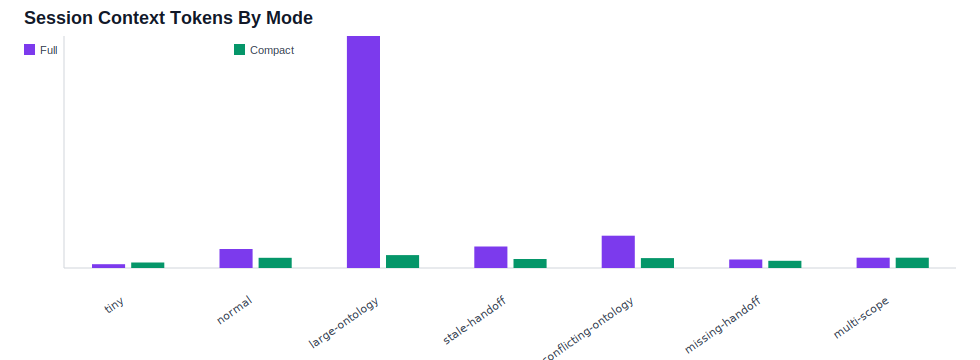
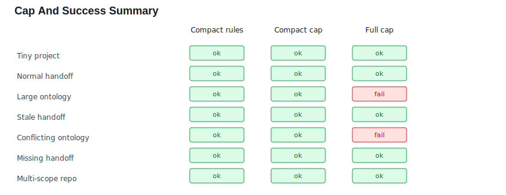

# anamnesis

> **AI coding agent config lifecycle manager.**
> Keep your AI coding agents from forgetting what your project is.

[]() [](LICENSE) []()

---

## The problem

Every time you open a project with Claude Code (or Codex, Cursor, …), your agent starts blank.
No project conventions. No ontology. No context.

So you write an `AGENTS.md`, ontology files, hooks, slash commands,
skills, and handoff notes — and then you do it again for the next
project. And the project after that.

Switching tools has the same failure mode. A project configured for
Claude Code does not automatically give Codex or Cursor the same current
context, ontology, handoff state, and operating rules.

The word **anamnesis** (ἀνάμνησις) means *"not forgetting"* in Greek — the literal opposite of *amnesia*. This tool prevents **agent amnesia**.

---

## What anamnesis does

- **Installs always-loaded context**: project memory, ontology slices,
  handoff instructions, operational reminders, skills, hooks, and command
  intent.
- **Keeps context portable across agents**: the same Agentfile and
  fragment capabilities render to Claude Code, Codex, and Cursor so the
  next agent can continue without a bespoke "read these files first"
  prompt.
- **Detects** stack-specific concerns from your project files
  (`prisma/schema.prisma`, `@nestjs/core` in `package.json`, `uv.lock`,
  …) and overlays the matching fragment.
- **Re-syncs** as the library evolves, *preserving your edits* — files
  you've authored or modified are never overwritten without consent.
- **Promotes** your project-local hooks/skills back into the library so
  other projects benefit.

It is **not** an application scaffolder (no `package.json`, no source code generation). It manages the small markdown/yaml/shell ecosystem your AI agent reads, and can optionally scaffold project-facing docs when explicitly requested.

---

## Quickstart

Install (npm — scoped package, the unscoped `anamnesis` name is taken
by an unrelated project):

```bash
npm install -g @mcprotein/anamnesis
```

…or run on demand without global install:

```bash
npx @mcprotein/anamnesis init --dry-run
```

Either way, the CLI is invoked as `anamnesis`.

Building from source instead (during development or for forks):

```bash
git clone https://github.com/MCprotein/anamnesis
cd anamnesis
npm install
npm run build       # produces cli/dist/
npm link            # makes `anamnesis` available globally
```

Then in any project:

```bash
cd /path/to/your/project
anamnesis init --dry-run                 # preview what would happen
anamnesis init --allow-exec-adapters     # actually install
anamnesis init --tools all --allow-exec-adapters
# install Claude Code, Codex, and Cursor surfaces on first init
anamnesis init --scaffold-docs --allow-exec-adapters
# also create missing README.md and docs/PROJECT-CONTEXT.md starter docs
anamnesis init --enhance-docs --allow-exec-adapters
# add managed context-review sections to existing README/docs
```

When an AI agent runs the setup for you, it should use the
`anamnesis-init` skill first. That skill asks a single multiple-choice
question about README/docs handling, then maps the answer to no docs flag,
`--scaffold-docs`, or `--enhance-docs`.

What gets created:

```
your-project/
├── Agentfile                                    # selected fragments + tool list
├── AGENTS.md                                    # canonical context (existing prose preserved)
├── CLAUDE.md                                    # Claude Code entrypoint pointing to AGENTS.md
├── .anamnesis/
│   ├── manifest.json                            # region/file hashes for drift detection
│   ├── ontology/{base,<fragment>}.yaml          # static ontology slices
│   ├── ontology/*.bootstrap.yaml                # deterministic project facts
│   └── handoff/active.md                        # current work index when handoff is used
├── .claude/                                     # Claude Code adapter output
│   ├── hooks/{inject-ontology, remind-uncommitted, …}.sh
│   ├── commands/load-context.md
│   └── skills/load-context/SKILL.md
├── .cursor/rules/                               # Cursor adapter output when enabled
├── .codex/{config.toml,hooks.json}              # Codex native hooks when enabled
├── .anamnesis/codex-native-hooks/               # Codex native hook wrappers
└── .anamnesis/codex-hooks/                      # Codex git-hook bridge when enabled
```

`AGENTS.md` is *additive* — anamnesis appends regions inside `<!-- anamnesis:region ... -->` anchors. Anything outside the anchors is yours.

`README.md` and `docs/PROJECT-CONTEXT.md` are opt-in. Use
`--scaffold-docs` to create missing starter docs, or `--enhance-docs` to add
managed context-review regions to existing docs without replacing your prose.

---

## Lifecycle

```bash
anamnesis init      # first-time setup; writes install evidence
anamnesis update    # library updates + drift detection (dry-run by default; --apply writes evidence)
anamnesis update --bump-pinned  # explicitly move pinned fragments to current
anamnesis status    # fragments, drift, ontology gaps, continuity, evidence, context diagnostic summary
anamnesis doctor    # read-only installation integrity + continuity/ontology/context diagnostics
anamnesis doctor --append  # record doctor diagnostics as runtime evidence
anamnesis hooks summary --append  # summarize hook logs and record runtime evidence
anamnesis migrate agentfile  # schema migration readiness check; --apply writes after backup
anamnesis dogfood check --append  # score and record self-check continuity evidence
anamnesis context index --write  # build a local source-pointer index
anamnesis context query "managed region"  # retrieve exact context pointers
anamnesis context diagnose  # report handoff, ontology, and evidence consistency issues
anamnesis benchmark report --append  # record deterministic context-quality scorecard evidence
anamnesis benchmark compare --baseline before.json --after after.json --append  # record before/after deltas
anamnesis benchmark gallery --write  # refresh evidence-backed README claim candidates
anamnesis benchmark gallery --validate  # fail when gallery evidence is stale
anamnesis benchmark trace --append  # roll up benchmark trace logs as runtime evidence
anamnesis benchmark task --template  # create a model-dependent task/retrieval benchmark input
anamnesis benchmark task --input task-run.json --append  # record an agent task run separately
anamnesis benchmark task-compare --template  # create a paired full/compact task template
anamnesis benchmark task-compare --full full.json --compact compact.json --append  # compare paired full/compact task runs
anamnesis benchmark task-series --write  # roll up repeated task-compare evidence with graphs
anamnesis benchmark prompt-gate  # decide using scorecard, session-context, and retrieval evidence
anamnesis promote   # lift a project-local file into the library as a reusable fragment
```

Re-running `update` on an unchanged project produces only `noop` results. User edits are surfaced as `user-modified` and library updates skip them. Backups go to `.anamnesis/backups/<timestamp>/`; `settings.backup_retention` keeps the newest N backup directories (`0` means unlimited).

### Generation boundary

anamnesis separates deterministic CLI generation from agent-assisted
semantic generation:

| Generated by | Output | Meaning |
|---|---|---|
| CLI (`init`, `update`) | `AGENTS.md`, static `.anamnesis/ontology/*.yaml`, adapter surfaces | Managed context, baseline ontology slices, and tool-specific read surfaces |
| Agent (`anamnesis-init`) | selected `anamnesis init` command flags | Multiple-choice README/docs choice before an agent runs first-time setup for the user |
| CLI (`ontology bootstrap`) | `.anamnesis/ontology/*.bootstrap.yaml` | Regenerable Layer A facts under `schema_version: anamnesis.bootstrap.v1` with deterministic `generator` and `facts` fields |
| Agent (`/ontology-enrich`) | `.anamnesis/ontology/*.enriched.yaml` | Layer B semantics under `schema_version: anamnesis.enriched.v1` with stable IDs, evidence, confidence, append-safe re-runs, `supersedes`, and `open_questions` |
| Agent (`/handoff-prepare`) | `.anamnesis/handoff/active.md` plus timestamped archives | Current task state for switching sessions or agents |

CLI commands print this boundary so users can tell whether the current
project state is CLI-generated, agent-enriched, or still missing semantic
handoff/ontology context. `status` also reports ontology gaps across static
slices, missing or stale deterministic bootstrap facts, semantic enrichment,
and fragments that do not yet have a Layer A introspector; `doctor` turns
actionable gaps into repair warnings. When Layer A facts are missing or
stale, the guidance continues into `/ontology-enrich` so the active agent can
draft the semantic `.enriched.yaml` layer instead of leaving users to write it
by hand.

Layer A is intentionally a baseline, not a promise to model every framework
in depth. The CLI extracts facts it can prove from files; Layer B uses the
active agent to turn those facts into relationships, flows, intent,
invariants, and open questions that future agents can reuse.

---

## Fragment catalog

| id | trigger | capabilities |
|---|---|---|
| `base` | always (auto-included) | project_memory, ontology, 4× executable_hook, 2× slash_command, 3× skill |
| `prisma` | `@prisma/client` in `package.json` or `prisma/schema.prisma` | project_memory, ontology, executable_hook |
| `k8s` | `k8s/` directory | project_memory, ontology, executable_hook (yaml-lint) |
| `nestjs` | `@nestjs/core` in `package.json` | project_memory, ontology |
| `nextjs` | `next` in `package.json` | project_memory, ontology |
| `fastapi` | `fastapi` in `pyproject.toml` | project_memory, ontology |
| `python-uv` | `uv.lock` exists | project_memory, ontology |
| `docker-compose` | `docker-compose.yml` / `compose.yaml` | project_memory, ontology |
| `rails` | `Gemfile` + `config/application.rb` | project_memory, ontology |
| `django` | `django` in `pyproject.toml` or `manage.py` | project_memory, ontology |
| `go` | `go.mod` exists | project_memory, ontology |
| `rust` | `Cargo.toml` exists | project_memory, ontology |
| `sveltekit` | `@sveltejs/kit` in `package.json` | project_memory, ontology |
| `remix` | `@remix-run/node` / `@remix-run/react` in `package.json` | project_memory, ontology |
| `nuxt` | `nuxt` in `package.json` | project_memory, ontology |

Triggers are evaluated by [`rulebook.md`](rulebook.md). Add your own fragment with `anamnesis promote` or by adding a directory under `fragments/`.

---

## Capability model

Each fragment declares one or more **capabilities** in `fragment.yaml`. Capabilities are tool-agnostic; **adapters** render them onto a specific tool's surface.

| Capability | What it represents | Claude Code | Codex | Cursor |
|---|---|---|---|---|
| `project_memory` | Always-loaded context | `AGENTS.md` region + `CLAUDE.md` entrypoint | `AGENTS.md` region | `AGENTS.md` region read by Cursor |
| `ontology` | Structured reference | SessionStart hook injection | Codex native SessionStart wrapper + AGENTS fallback | rules instruction |
| `executable_hook` | Event-driven automation | `.claude/hooks/*.sh` | native wrappers for Codex-supported lifecycle events; AGENTS fallback + optional git hook bridge | rules fallback |
| `skill` | Reusable procedure | `.claude/skills/<n>/SKILL.md` | AGENTS.md section (fallback) | rules (fallback) |
| `slash_command` | User-invoked command | `.claude/commands/<n>.md` | AGENTS.md section (fallback) | rules (fallback) |

The adapters do not promise identical native UI. Claude Code, Codex, and
Cursor expose different primitives, so anamnesis targets **user-facing
parity**: project recall, ontology access, handoff continuity, and
operational guardrails should survive switching agents.

Detail in [`docs/ADAPTER-PARITY.md`](docs/ADAPTER-PARITY.md),
[`docs/AGENT-SWITCHING-GUIDE.md`](docs/AGENT-SWITCHING-GUIDE.md), and
[`docs/DESIGN.md`](docs/DESIGN.md).

---

## Evidence

anamnesis is dogfooded on itself. Public claims are limited to sanitized
fixtures and self-check evidence; private-project validation is kept out of
README, packaged docs, and public benchmark artifacts.

### Session context benchmark

v1.5 changed SessionStart from full file-body injection to compact source
pointers plus invariant digests. The deterministic benchmark compares both
modes across public-safe fixtures.





Current run:

- Large ontology fixture: compact mode reduced estimated startup tokens by
  `94%`.
- Hard-cap outcomes: compact mode exceeded the cap `0` times; full mode
  exceeded it `2` times.
- Required retrieval rules and source pointers were present in `7/7`
  compact fixture runs.

Full generated evidence is in
[`docs/benchmark-evidence/session-context/`](docs/benchmark-evidence/session-context/).

Current self-check records live in [`docs/DOGFOOD.md`](docs/DOGFOOD.md).
Public-safe benchmark boundaries live in
[`docs/BENCHMARK-GALLERY.md`](docs/BENCHMARK-GALLERY.md), and broader
ecosystem claims stay intentionally disallowed. The claim ledger is
[`docs/README-CLAIMS.md`](docs/README-CLAIMS.md).
Model-dependent task diagnostics live separately in
[`docs/AGENT-TASK-BENCHMARKS.md`](docs/AGENT-TASK-BENCHMARKS.md) and are not
used for deterministic README score claims.

---

## Safety

- **`--allow-exec-adapters`** flag is *required* for installs into `.claude/{hooks,commands,skills}/`. Default is content-only (AGENTS.md regions, ontology slices). This blocks remote-fragment supply-chain risk.
- **Files on disk that aren't in the manifest** are classified as `user-modified` and never overwritten. This catches both pre-existing files (from before anamnesis adoption) and post-install user edits.
- **`update` is dry-run by default**. Pass `--apply` to actually write.
- **Backups** are taken automatically before `update --apply` modifies any file.

---

## Roadmap

| Version | Theme | Status |
|---|---|---|
| **v0.1** | Claude Code adapter + idempotency model | shipped 2026-04-26 |
| **v0.2** | Multi-tool (Codex), monorepo `scopes`, `status`, npm publish | shipped 2026-04-27 |
| **v0.3** | Cursor adapter, Codex hook/skill/slash fallback, monorepo init UX, **agent handoff MVP** | shipped 2026-04-28 |
| **v0.4** | Hybrid ontology bootstrap, `/ontology-enrich`, init auto-bootstrap, continuity polish | shipped 2026-04-29; 0.4.1 expands framework introspectors; 0.4.2 ships operational polish |
| **v0.5** | Dogfood lifecycle validation and agent-switch continuity hardening | shipped 2026-04-30 |
| **v0.6** | Repeatable bounded ontology generation plus agent-assisted enrichment | shipped 2026-05-03 |
| **v0.7** | Multi-agent UX, lifecycle scale, and benchmark reports | shipped 2026-05-03 |
| **v0.8** | Schema, API, migration, and repair workflow stabilization | shipped 2026-05-04 |
| **v0.9** | Registry, signing, docs, and public benchmark readiness | shipped 2026-05-04 |
| **v1.0** | Stable schema, public API, migration surface, docs, and evidence-backed claims | shipped 2026-05-04 |
| **v1.1** | Codex native lifecycle hooks, hook diagnostics, real hook smokes, and runtime evidence | shipped 2026-05-07; latest patch 1.1.1 |
| **v1.2** | Numeric benchmark evidence, public scorecards, and runtime evidence expansion | shipped 2026-05-08; latest patch 1.2.1 |
| **v1.3** | Fragment dependency resolution and update event hooks | shipped 2026-05-08 |
| **v1.4** | Adoption automation and project context bootstrap | shipped 2026-05-11; latest patch 1.4.4 |
| **v1.5** | Compact SessionStart defaults and session-context benchmark graphs | shipped 2026-06-19 |

Detailed plan: [`docs/ROADMAP.md`](docs/ROADMAP.md).
Monorepo application guide: [`docs/MONOREPO.md`](docs/MONOREPO.md).

---

## Documentation

- [`docs/ROADMAP.md`](docs/ROADMAP.md) — version-by-version plan
- [`docs/AGENT-SWITCHING-GUIDE.md`](docs/AGENT-SWITCHING-GUIDE.md) —
  install once, switch agents, and continue work without re-briefing
- [`docs/AGENTFILE-SCHEMA-AUDIT.md`](docs/AGENTFILE-SCHEMA-AUDIT.md) —
  v0.8 audit of Agentfile fields, compatibility fixtures, and v1.0 freeze risks
- [`docs/AGENTFILE-V1-FREEZE.md`](docs/AGENTFILE-V1-FREEZE.md) —
  v1 Agentfile freeze decisions, reserved fields, and strict parser policy
- [`docs/AGENTFILE-MIGRATIONS.md`](docs/AGENTFILE-MIGRATIONS.md) —
  `anamnesis migrate agentfile` command contract
- [`docs/API.md`](docs/API.md) — v1.0 TypeScript API stability contract
- [`docs/REPAIR.md`](docs/REPAIR.md) — repair playbook for existing managed projects
- [`docs/FRAGMENT-AUTHORING.md`](docs/FRAGMENT-AUTHORING.md) —
  public fragment authoring guide, review checklist, versioning, and compatibility rules
- [`docs/FRAGMENT-REGISTRY.md`](docs/FRAGMENT-REGISTRY.md) —
  v0.9 registry metadata, discovery, version selection, cache, and trust-boundary design
- [`docs/FRAGMENT-SIGNING.md`](docs/FRAGMENT-SIGNING.md) —
  v0.9 remote fragment checksum, signature, trust-store, and rejection policy
- [`docs/REGISTRY-V1-DECISION.md`](docs/REGISTRY-V1-DECISION.md) —
  v1.0 decision to keep remote registry/signing implementation post-v1.0
- [`docs/DOCS-SITE-PLAN.md`](docs/DOCS-SITE-PLAN.md) —
  v0.9 GitHub-first docs decision, information architecture, and future site trigger
- [`docs/DOCS-V1-AUDIT.md`](docs/DOCS-V1-AUDIT.md) —
  v1.0 public documentation coverage and known limitation audit
- [`docs/REMOTE-SYNC-STRATEGY.md`](docs/REMOTE-SYNC-STRATEGY.md) —
  v1.0 decision to omit broad `sync` and keep registry refresh/update explicit
- [`docs/ADAPTER-PARITY.md`](docs/ADAPTER-PARITY.md) — tested capability
  parity matrix across Claude Code, Codex, and Cursor
- [`docs/SWITCHING-SCENARIOS.md`](docs/SWITCHING-SCENARIOS.md) — tested
  3x3 source/target handoff scenarios across supported agents
- [`docs/BENCHMARKS.md`](docs/BENCHMARKS.md) — deterministic context-quality
  benchmark reports
- [`docs/AGENT-TASK-BENCHMARKS.md`](docs/AGENT-TASK-BENCHMARKS.md) —
  model-dependent task benchmark harness and claim boundary
- [`docs/BENCHMARK-GALLERY.md`](docs/BENCHMARK-GALLERY.md) —
  public-safe benchmark evidence, claim policy, and collection targets
- [`docs/README-CLAIMS.md`](docs/README-CLAIMS.md) —
  v1.0 evidence-backed README claim ledger
- [`docs/MONOREPO.md`](docs/MONOREPO.md) — applying anamnesis to a monorepo
- [`docs/ONTOLOGY-BOOTSTRAP.md`](docs/ONTOLOGY-BOOTSTRAP.md) — two-layer ontology generation
- [`docs/RELEASING.md`](docs/RELEASING.md) — npm Trusted Publishing release flow
- [`docs/DESIGN.md`](docs/DESIGN.md) — architecture, capability model, idempotency
- [`specs/agentfile.md`](specs/agentfile.md) — `Agentfile` v1 schema
- [`rulebook.md`](rulebook.md) — auto-detection rules and trigger DSL
- [`CONTRIBUTING.md`](CONTRIBUTING.md) — adding fragments, writing capabilities
- [`CHANGELOG.md`](CHANGELOG.md) — release notes

---

## License

MIT — see [LICENSE](LICENSE).
