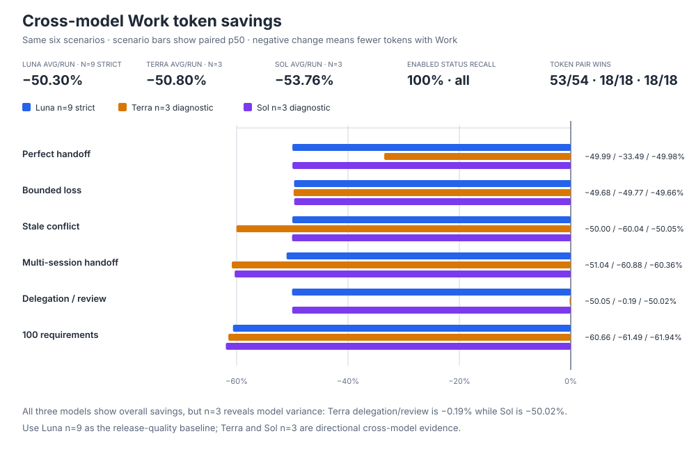

# anamnesis

> **Portable project memory for AI coding agents.**
> Keep Claude Code, Codex, and Cursor aligned without re-explaining the project every session.

[](https://github.com/MCprotein/anamnesis/actions/workflows/publish.yml)
[](https://www.npmjs.com/package/@mcprotein/anamnesis)
[](LICENSE)

Every new agent session starts with partial memory. Tool switches make it worse:
Claude Code, Codex, and Cursor expose different context, hook, skill, and command
surfaces.

anamnesis keeps one project-owned source of truth and renders it onto each tool.
It manages context, ontology, active handoffs, Work state, hooks, and skills while
preserving user-authored content.

## Why use it

- **Continue instead of re-briefing.** Active Work, requirements, evidence, and
  handoffs survive compaction, new sessions, and agent switches.
- **One configuration, multiple agents.** The same `Agentfile` drives Claude
  Code, Codex, and Cursor integrations.
- **Bounded context.** Startup stays compact; detailed facts remain retrievable
  through source pointers.
- **Safe updates.** Dry-runs, managed regions, drift detection, backups, and an
  explicit executable-adapter gate protect local edits.
- **Evidence-backed claims.** Public benchmarks use sanitized fixtures and keep
  raw prompts and model answers out of committed artifacts.

## Measured Work continuity

The latest published real-Codex benchmark compares Work disabled and enabled
across six continuity scenarios and nine paired repetitions per scenario.
Correction turns are charged to the condition that needed them.


| Published strict 9-pair benchmark | Change with Work |
| --- | ---: |
| Average total tokens/run | **-50.30%** |
| Average elapsed time/run | **-44.19%** |
| Status recall | **72.59% → 100%** |
| Re-explained requirements/run | **17.11 → 0.33** |

Both conditions retained 100% completion and gate correctness; Work also reached
100% requirement and summary recall with no hallucinated or duplicate
requirements. The strict contract passed all six scenarios (108 initial calls,
153 including bounded corrections). See the
[scenario evidence](docs/benchmark-evidence/work-agent-ab/README.md) and
[methodology](docs/AGENT-TASK-BENCHMARKS.md).

The same six-scenario diagnostic on `gpt-5.6-terra` (`n=3`) reproduced the
overall direction: **-50.80% tokens**, **-44.56% elapsed time**, 100% enabled
status recall, and 18/18 token pair wins. Scenario variance remains material —
delegation/review was nearly flat at -0.19% — so Luna `n=9` remains the strict
baseline and Terra is directional cross-model evidence.



[Terra diagnostic evidence](docs/benchmark-evidence/work-agent-ab/terra-3pair/README.md)

## Quickstart

Install the scoped package (`anamnesis` without the scope is an unrelated npm
package):

```bash
npm install -g @mcprotein/anamnesis
```

Preview first-time setup in a project:

```bash
cd /path/to/your/project
anamnesis init --dry-run
```

Install the managed project context and native agent adapters:

```bash
anamnesis init --tools all --allow-exec-adapters
anamnesis status
```

Native hooks, commands, skills, and Cursor rules are written only when
`--allow-exec-adapters` is explicit. Content-only setup remains the default.

For existing projects, preview before applying updates:

```bash
anamnesis upgrade plan
anamnesis apply --dry-run --allow-exec-adapters
anamnesis apply --allow-exec-adapters
anamnesis doctor
```

New installs materialize an active Work profile: adaptive continuity
briefings, advisory independent review, automatic delegation assessment, and
bounded repository-side prompt-capture policy. Existing projects retain their
current behavior; explicit opt-out and trust-boundary details are in the
[user guide](docs/USER-GUIDE.md#active-work-defaults-and-opt-out).

Running `anamnesis` prints the short first-run guide. Use `anamnesis --help` for
grouped help and `anamnesis --help --all` for the complete command reference.

## What it manages

```text
your-project/
├── Agentfile                         # fragments, tools, and policy
├── AGENTS.md                         # canonical managed context + your prose
├── CLAUDE.md                         # Claude Code entrypoint
├── .anamnesis/
│   ├── manifest.json                 # drift and ownership evidence
│   ├── ontology/                     # static, bootstrap, and enriched context
│   ├── handoff/                      # active and archived handoffs
│   └── work-units/                   # typed Work ledgers and projections
├── .claude/                          # Claude Code adapters
├── .codex/                           # Codex hooks, config, and skills
└── .cursor/rules/                    # Cursor rules
```

Managed `AGENTS.md` sections use `<!-- anamnesis:region ... -->` anchors.
Content outside those anchors remains yours. anamnesis is a context lifecycle
manager, not an application scaffolder; it does not generate project source code.

## Core workflow

```bash
anamnesis init --dry-run              # preview first installation
anamnesis apply --dry-run             # preview managed updates
anamnesis apply                       # apply reviewed updates
anamnesis status                      # inspect drift and continuity state
anamnesis doctor                      # run integrity diagnostics
anamnesis context query "<terms>"     # retrieve exact source pointers
anamnesis context resume              # render a compact resume bundle
anamnesis work status --work <id>     # refold authoritative Work state
```

The [user guide](docs/USER-GUIDE.md) covers setup choices, lifecycle commands,
generation boundaries, fragments, capability mapping, and building from source.

## Safety model

- Executable agent surfaces require `--allow-exec-adapters`.
- `apply --dry-run` previews managed writes.
- User-modified or untracked files are not silently overwritten.
- Backups are created before managed files are changed.
- Work mutations use typed append-only evidence, expected-head checks, and
  fail-closed review/delegation policy boundaries.

See [DESIGN.md](docs/DESIGN.md) and [WORK-UNIT-DESIGN.md](docs/WORK-UNIT-DESIGN.md)
for the detailed trust and execution model.

## Documentation

- [User guide](docs/USER-GUIDE.md) — setup, lifecycle, fragments, capabilities
- [Work design](docs/WORK-UNIT-DESIGN.md) — requirements, evidence, policy, briefings
- [Agent switching guide](docs/AGENT-SWITCHING-GUIDE.md) — move between supported agents
- [Benchmarks](docs/BENCHMARKS.md) — evidence index and deterministic suites
- [Work A/B evidence](docs/benchmark-evidence/work-agent-ab/README.md) — scenario results and limitations
- [Terra Work A/B diagnostic](docs/benchmark-evidence/work-agent-ab/terra-3pair/README.md) — three-pair cross-model evidence
- [Roadmap](docs/ROADMAP.md) — shipped and deferred work
- [Contributing](CONTRIBUTING.md) — fragments and project development
- [Changelog](CHANGELOG.md) — release history

## License

MIT — see [LICENSE](LICENSE).
