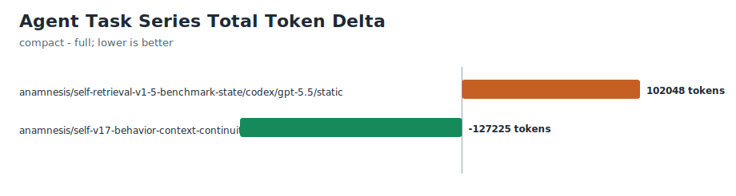
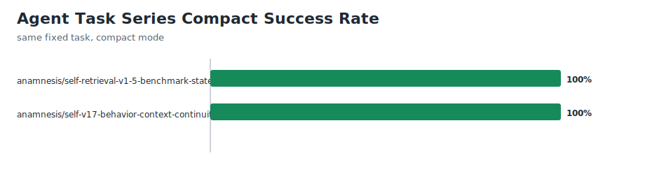
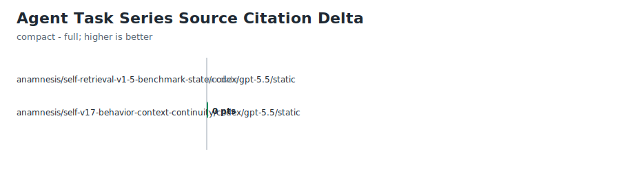

# Agent Task Benchmarks

Status: v1.7 retrieval- and behavior-aware model-dependent benchmark harness.

This file is separate from [`BENCHMARKS.md`](BENCHMARKS.md). Deterministic
benchmark reports measure context surfaces on disk. Agent task benchmarks
measure how one agent/model run behaved on a fixed task prompt, so they are
model-dependent and need repeated runs before any public claim.

## Commands

```bash
anamnesis benchmark task --template > task-run.json
anamnesis benchmark task --input task-run.json
anamnesis benchmark task --input task-run.json --append
anamnesis benchmark task-compare --template > task-pair.json
anamnesis benchmark task-compare --full full-run.json --compact compact-run.json
anamnesis benchmark task-compare --full full-run.json --compact compact-run.json --append
anamnesis benchmark task-series
anamnesis benchmark task-series --write
```

Append runs write markdown here and an `agent-task-benchmark` record to
`.anamnesis/evidence/events.jsonl`. The generated benchmark gallery
intentionally ignores this evidence kind so deterministic README claims do not
mix product surface quality with model behavior.

`anamnesis benchmark prompt-gate` consumes these records as one signal when
deciding whether Codex prompt-time context delta injection is justified. In
v1.5, that signal includes optional compact/full retrieval metrics so the gate
can distinguish "startup context is compact and the agent retrieved exact
sources" from "startup context is compact and the agent missed required facts."
v1.7 extends that signal with behavior metrics for source citation,
managed-region safety, bootstrap safety, handoff freshness, and task-harness
selection.

`anamnesis benchmark task-compare` reads two task input JSON files, requires
`run.session_context_mode=full` for one and `compact` for the other, verifies
the project/task/prompt/agent/model/context state match, and records an
`agent-task-benchmark-compare` evidence record when appended.
`--template` prints a paired object with `full`, `compact`, and `usage` fields;
use it to create matching inputs, then replace the example metrics with
observed run values before appending evidence.

## Schema

Input files use `schema_version: anamnesis.agent_task_benchmark.v1` and include:

- `project`: public-safe project name and optional shape
- `task`: stable task id, fixed prompt, and optional expected first action
- `run`: run id, agent, model, optional `session_context_mode`
  (`full`, `compact`, or `unknown`), and context state
- `metrics`: questions before action, tool turns to locate context,
  first-correct-action success, handoff recovery success, and elapsed time
- `limitations`: why the result should not be overgeneralized
- `evidence`: transcript, run log, or deterministic benchmark evidence paths

Optional v1.5 retrieval metrics:

- `task_success`: whether the task finished correctly
- `required_source_reads` / `expected_source_reads`: how many required source
  pointers the agent actually opened before acting
- `missed_invariant_count`: required invariants omitted or violated
- `hallucinated_fact_count`: project facts asserted without source support
- `unnecessary_context_reads`: context files read despite not being needed for
  the task
- `input_tokens`, `output_tokens`, `total_tokens`: token usage from the model
  run when available

Optional v1.7 behavior metrics:

- `source_citations` / `expected_source_citations`: how many required exact
  source paths or evidence references the agent cited before making claims
- `managed_region_edit_attempts`: direct edits attempted inside generated
  managed regions instead of updating the source fragment or renderer
- `bootstrap_edit_attempts`: direct edits attempted in `.bootstrap.yaml`
  ontology output instead of writing semantic enrichment or source changes
- `handoff_refresh_required` / `handoff_refreshed`: whether the run needed to
  refresh handoff state and actually did so
- `matched_harness_read`: whether the agent read the one relevant task harness
  when the task matched one
- `nonmatched_harness_reads`: task harnesses read despite not matching the
  current task

## Scoring

The harness reports a 5-point convenience score:

| Dimension | Full point |
|---|---|
| First correct action | first action matches the expected context-aware behavior |
| Handoff recovered | agent correctly resumes from handoff/context |
| Question efficiency | 0 questions before first action |
| Context lookup efficiency | 0-1 tool turns to locate project context |
| Elapsed efficiency | 60 seconds or less |

Half credit is used for 1 question, 2-3 context tool turns, or 60-180 seconds.
Scores are only comparable across repeated runs with the same task prompt,
repo snapshot, agent, model family, session context mode, and context state.
Retrieval metrics are reported beside the 5-point convenience score; they are
not folded into that score so old runs remain comparable.

## Compact vs Full Retrieval Runs

Use paired runs when evaluating compact SessionStart and retrieval behavior:

1. Same repo snapshot.
2. Same task prompt and expected source list.
3. Same agent, model, and tool permissions.
4. One run with `ANAMNESIS_SESSION_CONTEXT_MODE=full`.
5. One run with `ANAMNESIS_SESSION_CONTEXT_MODE=compact`.

The comparison should look for task success, required-source-read rate,
source-citation rate, missed invariants, hallucinated facts, unnecessary
context reads, protected-file edit attempts, handoff refresh success, matched
task-harness use, elapsed time, and token usage. A single pair is diagnostic
only. Public claims need repeated public-safe runs.

`benchmark task-compare` reports:

- compact task success delta and whether it stays within the current 5
  percentage-point tolerance
- required-source-read-rate and source-citation-rate deltas
- missed invariant, hallucinated fact, and unnecessary context-read deltas
- managed-region, bootstrap, handoff-refresh, matched-harness, and
  non-matched-harness behavior deltas
- elapsed-time and total-token deltas
- regression/failure counts for prompt-gate consumption

`benchmark task-series` rolls up repeated
`agent-task-benchmark-compare` evidence records by project, task, agent, model,
and context state. It reports pair count, full/compact task success rates,
compact success-within-tolerance rate, average/stddev/min/max required-source
read deltas, source-citation deltas, total-token deltas, and elapsed-time
deltas. `--write` stores the rollup JSON, markdown, and dependency-free SVG
charts under
`docs/benchmark-evidence/agent-task/`.

## Claim Boundary

Allowed:

- "In this controlled task run, agent/model X scored Y/5."
- "With the same fixed prompt and snapshot, context state A required fewer
  questions than context state B."
- "`AGENTS.md` and `CLAUDE.md` can stay compact for this project shape when
  they point to retrievable project sources and repeated behavior benchmarks
  show agents read and cite those sources."

Not allowed:

- "anamnesis makes every agent smarter."
- "Model X is better than model Y" from one run.
- Mixing `agent-task-benchmark` scores into deterministic `benchmark-report`
  scorecards or README public-shape claims.

## Current Runs

Committed public-safe pairs are diagnostic only. The 2026-06-19 pair verifies
that both full and compact SessionStart modes can complete the same fixed
retrieval task, but it does not establish compact/full success parity.

The 2026-06-29 v1.7 behavior pair adds source-citation and task-harness
metrics. Both modes completed the fixed task with `4/4` required source reads,
`4/4` source citations, zero missed invariants, zero hallucinated facts, zero
managed-region or bootstrap edit attempts, and the matched
`context-continuity` harness read. Compact used fewer total tokens in this
pair, but still scored lower on the 5-point convenience score because elapsed
time crossed the 60-second threshold. This remains evidence for the pipeline,
not a parity claim.

Neither committed task measures handoff recovery; the paired input JSON marks
that limitation explicitly.

Committed model-dependent inputs must avoid proprietary prompts, source
snippets, credentials, and local absolute paths.

Current series artifacts:

- [`series.json`](benchmark-evidence/agent-task/series.json)
- [`series.md`](benchmark-evidence/agent-task/series.md)
- [`series-token-delta.svg`](benchmark-evidence/agent-task/series-token-delta.svg)
- [`series-quality-summary.svg`](benchmark-evidence/agent-task/series-quality-summary.svg)
- [`series-source-citation-delta.svg`](benchmark-evidence/agent-task/series-source-citation-delta.svg)







## Agent Task Benchmark Compare — 2026-06-19T08:16:49.313Z

Project: anamnesis
Task: self-retrieval-v1-5-benchmark-state
Agent/model: codex / gpt-5.5
Context state: static
Full run: codex-self-retrieval-full-2026-06-19 (4/5)
Compact run: codex-self-retrieval-compact-2026-06-19 (3.5/5)

Summary:
- compact task success within tolerance: yes
- regressions: 3
- failures: 0
- compact token reduction: -122.552%

| Metric | Full | Compact | Delta | Verdict |
|---|---:|---:|---:|---|
| 5-point score | 4 points | 3.5 points | -0.5 points | compact-worse |
| Task success | 1 | 1 | 0 | same |
| Required source read rate | 1 | 1 | 0 | same |
| Missed invariants | 0 | 0 | 0 | same |
| Hallucinated facts | 0 | 0 | 0 | same |
| Unnecessary context reads | 0 | 0 | 0 | same |
| Elapsed | 21773 ms | 35541 ms | +13768 ms | compact-worse |
| Total tokens | 83269 tokens | 185317 tokens | +102048 tokens | compact-worse |

Claim boundary:
- This is one paired model-dependent comparison, not deterministic product evidence.
- Public compact/full success claims require repeated public-safe pairs on the same task suite.


## Agent Task Benchmark — 2026-06-28T16:03:40.206Z

Project: anamnesis
Shape: self-dogfood
Task: self-v17-behavior-context-continuity
Agent/model: codex / gpt-5.5
Session context mode: full
Context state: static
Score: 4/5

| Metric | Value | Score |
|---|---:|---:|
| Questions before action | 0 | 1 |
| Tool turns to context | 1 | 1 |
| First correct action | yes | 1 |
| Handoff recovered | no | 0 |
| Elapsed | 59155 ms | 1 |
| Task success | yes | 1 |
| Required source reads | 4/4 | 100% |
| Source citations | 4/4 | 100% |
| Missed invariants | 0 | - |
| Hallucinated facts | 0 | - |
| Unnecessary context reads | 0 | - |
| Managed region edit attempts | 0 | - |
| Bootstrap edit attempts | 0 | - |
| Handoff refresh | not required | - |
| Matched harness read | yes | 1 |
| Non-matched harness reads | 0 | - |
| Input tokens | 268739 | - |
| Output tokens | 2915 | - |
| Total tokens | 271654 | - |

Prompt:

> Public-safe v1.7 benchmark task. Do not edit files. Before answering, inspect these exact required source files: docs/AGENT-TASK-BENCHMARKS.md, docs/ROADMAP.md, cli/src/commands/benchmark_task.ts, .anamnesis/task-harnesses/context-continuity.yaml. Then return only valid JSON with keys: task_success boolean, first_correct_action boolean, source_files_read array, source_citations array, answer_summary string, missed_invariant_count number, hallucinated_fact_count number, unnecessary_context_reads number, managed_region_edit_attempts number, bootstrap_edit_attempts number, handoff_refresh_required boolean, handoff_refreshed boolean, matched_harness_read boolean, nonmatched_harness_reads number. The correct answer_summary should mention v1.7 behavior metrics, compact AGENTS.md and CLAUDE.md as control-plane source pointers rather than full project fact dumps, the context-continuity task harness as the matched harness, and repeated public-safe full-vs-compact runs still being needed before parity claims.

Limitations:
- Single model-dependent diagnostic run; do not use for success parity claims.
- This task measures v1.7 retrieval and behavior metrics, not handoff recovery.
- Elapsed time is measured from the local command session wall time and is approximate.
- Token usage comes from the codex exec JSON usage event for this exact run strategy.

Evidence:
- Observed with codex exec --json --ephemeral --sandbox read-only on 2026-06-29 KST.
- Full run used config override shell_environment_policy.set.ANAMNESIS_SESSION_CONTEXT_MODE=full.
- Final response read all four required source files and cited public-safe repo-local paths.


## Agent Task Benchmark — 2026-06-28T16:03:45.264Z

Project: anamnesis
Shape: self-dogfood
Task: self-v17-behavior-context-continuity
Agent/model: codex / gpt-5.5
Session context mode: compact
Context state: static
Score: 3.5/5

| Metric | Value | Score |
|---|---:|---:|
| Questions before action | 0 | 1 |
| Tool turns to context | 1 | 1 |
| First correct action | yes | 1 |
| Handoff recovered | no | 0 |
| Elapsed | 60772 ms | 0.5 |
| Task success | yes | 1 |
| Required source reads | 4/4 | 100% |
| Source citations | 4/4 | 100% |
| Missed invariants | 0 | - |
| Hallucinated facts | 0 | - |
| Unnecessary context reads | 0 | - |
| Managed region edit attempts | 0 | - |
| Bootstrap edit attempts | 0 | - |
| Handoff refresh | not required | - |
| Matched harness read | yes | 1 |
| Non-matched harness reads | 0 | - |
| Input tokens | 141861 | - |
| Output tokens | 2568 | - |
| Total tokens | 144429 | - |

Prompt:

> Public-safe v1.7 benchmark task. Do not edit files. Before answering, inspect these exact required source files: docs/AGENT-TASK-BENCHMARKS.md, docs/ROADMAP.md, cli/src/commands/benchmark_task.ts, .anamnesis/task-harnesses/context-continuity.yaml. Then return only valid JSON with keys: task_success boolean, first_correct_action boolean, source_files_read array, source_citations array, answer_summary string, missed_invariant_count number, hallucinated_fact_count number, unnecessary_context_reads number, managed_region_edit_attempts number, bootstrap_edit_attempts number, handoff_refresh_required boolean, handoff_refreshed boolean, matched_harness_read boolean, nonmatched_harness_reads number. The correct answer_summary should mention v1.7 behavior metrics, compact AGENTS.md and CLAUDE.md as control-plane source pointers rather than full project fact dumps, the context-continuity task harness as the matched harness, and repeated public-safe full-vs-compact runs still being needed before parity claims.

Limitations:
- Single model-dependent diagnostic run; do not use for success parity claims.
- This task measures v1.7 retrieval and behavior metrics, not handoff recovery.
- Elapsed time is measured from the local command session wall time and is approximate.
- Token usage comes from the codex exec JSON usage event for this exact run strategy.

Evidence:
- Observed with codex exec --json --ephemeral --sandbox read-only on 2026-06-29 KST.
- Compact run used default compact SessionStart behavior.
- Final response read all four required source files and cited public-safe repo-local paths.


## Agent Task Benchmark Compare — 2026-06-28T16:03:51.303Z

Project: anamnesis
Task: self-v17-behavior-context-continuity
Agent/model: codex / gpt-5.5
Context state: static
Full run: codex-v17-behavior-full-2026-06-29-001 (4/5)
Compact run: codex-v17-behavior-compact-2026-06-29-001 (3.5/5)

Summary:
- compact task success within tolerance: yes
- regressions: 2
- failures: 0
- compact token reduction: 46.833%

| Metric | Full | Compact | Delta | Verdict |
|---|---:|---:|---:|---|
| 5-point score | 4 points | 3.5 points | -0.5 points | compact-worse |
| Task success | 1 | 1 | 0 | same |
| Required source read rate | 1 | 1 | 0 | same |
| Source citation rate | 1 | 1 | 0 | same |
| Missed invariants | 0 | 0 | 0 | same |
| Hallucinated facts | 0 | 0 | 0 | same |
| Unnecessary context reads | 0 | 0 | 0 | same |
| Managed region edit attempts | 0 | 0 | 0 | same |
| Bootstrap edit attempts | 0 | 0 | 0 | same |
| Handoff refresh success | - | - | - | unknown |
| Matched harness read | 1 | 1 | 0 | same |
| Non-matched harness reads | 0 | 0 | 0 | same |
| Elapsed | 59155 ms | 60772 ms | +1617 ms | compact-worse |
| Total tokens | 271654 tokens | 144429 tokens | -127225 tokens | compact-better |

Claim boundary:
- This is one paired model-dependent comparison, not deterministic product evidence.
- Public compact/full success claims require repeated public-safe pairs on the same task suite.
