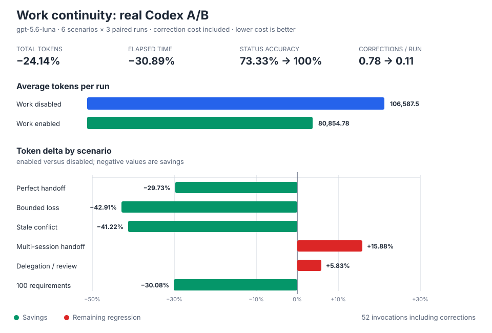

# Benchmarks

This file records deterministic context-quality benchmark reports generated by
anamnesis.

See also: [`BENCHMARK-GALLERY.md`](BENCHMARK-GALLERY.md) (public-curated
subset of this evidence), [`BENCHMARK-TRACES.md`](BENCHMARK-TRACES.md)
(append-only phase/timing rollups), and
[`AGENT-TASK-BENCHMARKS.md`](AGENT-TASK-BENCHMARKS.md) (model-dependent task
runs, kept separate — see its own note).

Run:

```bash
anamnesis benchmark report --append
anamnesis benchmark report --json > before.json
anamnesis benchmark report --json > after.json
anamnesis benchmark compare --baseline before.json --after after.json --append
anamnesis benchmark gallery --write
anamnesis benchmark gallery --validate
anamnesis benchmark trace --append
anamnesis benchmark prompt-gate
anamnesis benchmark session-context --write
anamnesis benchmark work-continuity --runs 5 --write
anamnesis benchmark work-agent-ab --runs 3 --write
anamnesis benchmark work-parallel-agent-ab --protocol validate
anamnesis benchmark work-parallel-agent-ab --protocol final --write
anamnesis context subagent-preamble
anamnesis benchmark subagent-injection --attempts 20 --write --append
anamnesis benchmark task-compare --template
```

Append runs also write a machine-readable evidence record to
`.anamnesis/evidence/events.jsonl`.

The report measures concrete surfaces on disk, not model intelligence:

- static ontology slices
- Layer A `.bootstrap.yaml` facts
- Layer B `.enriched.yaml` semantics
- continuity readiness
- adapter surface readiness
- scorecard v2 raw metrics: ready layers, continuity checks, ontology gaps,
  doctor issues, Codex hook warnings, adapter surfaces, and runtime evidence
  freshness

Public README claims must be based only on self-checks or explicitly sanitized
fixtures that expose no proprietary source snippets, project names, credentials,
hostnames, temp paths, or internal business logic.

Model-dependent task outcomes live in
[`docs/AGENT-TASK-BENCHMARKS.md`](AGENT-TASK-BENCHMARKS.md) via
`anamnesis benchmark task`. Do not merge those scores into deterministic
scorecards or generated benchmark-gallery README claims.

Use `benchmark prompt-gate` before adding any Codex `UserPromptSubmit`
context delta injection. The gate reads deterministic scorecard evidence,
session-context benchmark JSON, and model-dependent task evidence, including
optional compact/full retrieval metrics and paired task-compare evidence. It
estimates duplicate ontology/handoff prompt overhead, checks duplicate-context
risk, and returns one of three decisions:

- `defer`: keep prompt-time context delta disabled.
- `collect-more-evidence`: a gap exists, but repeated-gap evidence or
  token/noise controls are not sufficient.
- `prototype`: a bounded non-default experiment is justified; default shipping
  still needs dedupe and smoke evidence.

Human-facing prompt-gate reports label signal assessments as `pass`, `watch`,
or `risk`. Machine-readable evidence keeps the stable `pass` / `warn` /
`fail` signal statuses for compatibility.

Use `benchmark compare` for before/after adoption evidence. It reads two
`benchmark report --json` files and reports raw scorecard deltas rather than
collapsing the result into a single opaque score.

Use `benchmark work-continuity --runs <n> --write` for a same-scenario
before/after comparison of the Work continuity layer. The sanitized fixture
creates 20 requirements, verifies half, then crosses a compaction/resume
boundary. By default both conditions receive the same complete current facts:
the disabled condition reopens a persisted JSON handoff, while the enabled
condition refolds the authoritative Work ledger and builds a briefing. An
explicit smaller `--compact-window` is reported only as retention stress, not
as attributable before/after improvement. The report keeps structural recovery
quality separate from local runtime/storage overhead and writes evidence under
[`docs/benchmark-evidence/work-continuity/`](benchmark-evidence/work-continuity/).
These deterministic results do not measure model intelligence; actual task
success and token deltas still require repeated paired runs through
`benchmark task-compare` and `benchmark task-series`.

Use `benchmark work-agent-ab --runs <n> --write` for the corresponding
model-dependent same-scenario comparison, or
`npm run benchmark:work-agent-ab:strict` for the release-quality nine-pair
contract. It runs six sanitized paired
scenarios with Work disabled and enabled: complete handoff, bounded context
loss, stale status, multi-session handoff, pending delegation/review gates, and
100-requirement scale. Condition order alternates. A deterministic oracle
scores exact requirement/status reconstruction and gate/completion decisions;
an incorrect first response receives one bounded correction, and all correction
tokens and elapsed time remain charged to that condition. The evaluator keeps
equal-information and resilience scenarios labeled separately and stores no
prompts, model answers, fixture bodies, stderr, or host paths.

The checked-in `gpt-5.6-luna` strict evidence uses nine paired repetitions per
scenario: 108 initial paid model calls and 153 total invocations after bounded
oracle corrections. Work reduced average total tokens by 50.30% and elapsed
time by 44.19%, improved status recall from 72.59% to 100%, and retained 100%
completion and gate correctness. Enabled answers reached 100% requirement and
summary recall with no hallucinated or duplicate requirements. The strict
contract also passed paired token and elapsed non-regression gates for the
multi-session handoff and delegation/review scenarios.

An additional `gpt-5.6-terra` cross-model diagnostic uses three paired
repetitions across the same six scenarios. Its 36 initial calls and 46 total
invocations consumed 2,840,394 tokens. Work reduced average tokens by 50.80%
and elapsed time by 44.56%, reached 100% enabled requirement/status/summary
recall, and won all 18 token pairs. This is directional evidence rather than a
strict result: scenario dispersion was substantial, most visibly
delegation/review at a -0.19% paired token median. See the
[`terra-3pair` artifact](benchmark-evidence/work-agent-ab/terra-3pair/README.md)
and the
[`cross-model chart`](benchmark-evidence/work-agent-ab/work-agent-ab-cross-model.svg).

The matching `gpt-5.6-sol` diagnostic used 36 initial calls and 54 total
invocations, consuming 2,806,955 tokens. Work reduced average tokens by 53.76%
and elapsed time by 50.97%, reached 100% enabled requirement/status/summary
recall, and won all 18 token pairs. Unlike Terra, Sol retained a -50.02%
delegation/review paired token median; the difference reinforces that both
three-pair results are directional diagnostics rather than model-independent
performance guarantees. See the
[`sol-3pair` artifact](benchmark-evidence/work-agent-ab/sol-3pair/README.md).

Use `benchmark work-parallel-agent-ab --protocol validate` for the free local
preflight and `--protocol final --write` for the claim-eligible real-Codex run.
The frozen v3 final is three scenario families by three pairs: a clean
24-requirement partition, a 32-requirement cross-session history with stale,
superseded, and removed facts, and a 48-requirement review-recovery case with
condition-blind omission, duplication, stale-status, and misassignment faults.
Each condition executes five fully charged Luna stages: leader planning, two
concurrent child processes, authoritative review, and final leader integration.

`PASS_PRODUCT` requires every harness check plus a mean accuracy gain of at
least five points, an exact one-sided sign-test p-value at most 0.05, at least
six of nine paired wins, no family worse than two points, at least eight exact
reviewed pipelines overall and two per family, zero final malformed,
hallucinated, or duplicate rows, aggregate and paired token limits, and paired
critical-path limits with deterministic stratified 90% bootstrap upper bounds.
`PASS_EFFICIENCY` additionally requires a token or latency median improvement
of at least 10% with its bootstrap upper bound below zero. The final protocol
requires a clean implementation commit and records only one claim-eligible
attempt for that commit; validation and shadow runs are always inconclusive.

The historical v2 three-pair run used 30 calls. Harness validity passed every
concurrency, ordering, accounting, and no-exclusion check. Work improved final
exact-requirement accuracy from **33.33% to 100%**, winning **2/3** pairs with
one tie and a median gain of **24 requirements**, so the directional accuracy
comparison passed. The enabled absolute-quality gate remained **FAIL at 2/3**.
Average tokens increased **3.96%** and average critical-path time increased
**27.63%**; paired medians were **+2.63% tokens** (MAD 3.02pp) and
**+17.88% time** (MAD 16.29pp). This is an accuracy signal in one scenario, not
an efficiency, statistical-significance, or release-readiness claim. It measures separate
process orchestration, not same-session native subagent spawning or general
coding productivity. See the
[`parallel-agent artifact`](benchmark-evidence/work-parallel-agent-ab/README.md).

The evaluator requires exact summaries, rejects unexpected or duplicate
requirements, separates comparison classes, and records paired p50/p95/MAD and
deterministic 90% bootstrap intervals. It stores no prompts, model answers,
fixture bodies, stderr, or host paths. Historical three-pair diagnostic results
remain in version history; the strict artifact is the current public baseline.
Evidence lives under
[`docs/benchmark-evidence/work-agent-ab/`](benchmark-evidence/work-agent-ab/).



The checked-in evidence contains both the equal-facts default and a separately
labeled [`retention-stress`](benchmark-evidence/work-continuity/retention-stress/)
run with an eight-fact legacy window. Only the equal-facts result is a fair
runtime/storage before/after comparison; the stress result shows sensitivity
to information loss and is not an attributable product-effect claim.

Use `benchmark session-context --write` for the v1.5 startup-context budget
check. It compares full SessionStart file injection with compact invariant
digest/source-pointer context across public-safe fixtures, then writes JSON,
markdown, and dependency-free SVG charts under
[`docs/benchmark-evidence/session-context/`](benchmark-evidence/session-context/).
`benchmark prompt-gate` reads the generated `session-context.json` artifact
from this directory automatically.

Use `benchmark retrieval --write` for the v1.17 document-graph retrieval
check. It measures deterministic `context query` source-pointer ranking for
public-safe `doc-page`, `doc-heading`, and `doc-ontology-ref` fixtures, then
writes JSON, markdown, and dependency-free SVG charts under
[`docs/benchmark-evidence/retrieval-source-pointers/`](benchmark-evidence/retrieval-source-pointers/).
`benchmark prompt-gate` reads the generated `retrieval-source-pointers.json`
artifact automatically. This benchmark proves pointer ranking quality; actual
agent source-read behavior remains in task benchmarks.

Use `context subagent-preamble` to print the compact launcher-wrapper payload
for externally started subagents. Use
`benchmark subagent-injection --attempts <n> --write --append` for v1.15
subagent context evidence. It records raw repeated-run counts for the
launcher-wrapper preamble separately from same-session native subagent
prompt-contract acceptance, then writes JSON, markdown, runtime evidence, and
dependency-free SVG charts under
[`docs/benchmark-evidence/subagent-injection/`](benchmark-evidence/subagent-injection/).
Do not treat prompt-contract acceptance as automatic SessionStart injection.

Public-safe summaries and claim boundaries live in
[`docs/BENCHMARK-GALLERY.md`](BENCHMARK-GALLERY.md). Sanitized public-shape
machine evidence is stored in
[`docs/benchmark-evidence/public-shapes.jsonl`](benchmark-evidence/public-shapes.jsonl).

## Current Public Evidence

Current public evidence is intentionally conservative:

- self-dogfood for this repository
- sanitized fixture shapes only
- no private project names or organization repository identifiers
- no hostnames, credentials, local source paths, or proprietary domain details

## Benchmark Report — self repository

Project: anamnesis
Tools: claude-code, codex, cursor
Fragments: base

| Dimension | Value |
|---|---:|
| Continuity checks | 6/6 |
| Doctor errors | 0 |
| Codex hook warnings | 0 |
| Adapter surfaces | ready |

Boundary:

- This is deterministic self-check evidence for the repository itself.
- It is not a claim that every framework or private project shape is fully
  covered.
- Private validation may inform internal prioritization, but it must not be
  copied into public docs or package artifacts.


## Benchmark Report — 2026-07-02T07:45:35.483Z

Project: anamnesis
Tools: claude-code, codex, cursor
Fragments: base@14:in-sync
Ready layers: 3/5

Scorecard:

| Dimension | Value |
|---|---:|
| Ready layers | 3/5 |
| Continuity checks | 6/6 |
| Ontology warnings | 0 |
| Doctor errors | 0 |
| Doctor warnings | 0 |
| Codex hook warnings | 0 |
| Adapter surfaces | 1/1 |
| Evidence records | 25 valid / 0 invalid |

| Layer | Status | Score | Detail |
|---|---|---:|---|
| Static ontology | ready | 1/1 | 1 static ontology file(s) found |
| Layer A bootstrap | partial | 0/0 | 0 bootstrap file(s) found; no stale or missing Layer A warnings |
| Layer B enrichment | partial | 0/0 | 0 enriched file(s) found; no missing semantic enrichment warnings |
| Context continuity | ready | 6/6 | 6/6 continuity checks passing |
| Adapter surfaces | ready | 1/1 | enabled adapters have clean native or fallback surfaces (claude-code, codex, cursor) |

Ontology files:
- static: `.anamnesis/ontology/base.yaml`
- bootstrap: (none)
- enriched: (none)

Bootstrap dry-run outcomes: skipped-no-introspector=1
Continuity: ready (6/6)
Ontology gaps: 0 warning(s), 1 info
Doctor: ok (0 error(s), 0 warning(s))
Codex hook warnings: 0
Evidence records: 25 valid, 0 invalid


## Benchmark Report — 2026-07-02T07:56:38.583Z

Project: anamnesis
Tools: claude-code, codex, cursor
Fragments: base@14:in-sync
Ready layers: 3/5

Scorecard:

| Dimension | Value |
|---|---:|
| Ready layers | 3/5 |
| Continuity checks | 6/6 |
| Ontology warnings | 0 |
| Doctor errors | 0 |
| Doctor warnings | 0 |
| Codex hook warnings | 0 |
| Adapter surfaces | 1/1 |
| Evidence records | 27 valid / 0 invalid |

| Layer | Status | Score | Detail |
|---|---|---:|---|
| Static ontology | ready | 1/1 | 1 static ontology file(s) found |
| Layer A bootstrap | partial | 0/0 | 0 bootstrap file(s) found; no stale or missing Layer A warnings |
| Layer B enrichment | partial | 0/0 | 0 enriched file(s) found; no missing semantic enrichment warnings |
| Context continuity | ready | 6/6 | 6/6 continuity checks passing |
| Adapter surfaces | ready | 1/1 | enabled adapters have clean native or fallback surfaces (claude-code, codex, cursor) |

Ontology files:
- static: `.anamnesis/ontology/base.yaml`
- bootstrap: (none)
- enriched: (none)

Bootstrap dry-run outcomes: skipped-no-introspector=1
Continuity: ready (6/6)
Ontology gaps: 0 warning(s), 1 info
Doctor: ok (0 error(s), 0 warning(s))
Codex hook warnings: 0
Evidence records: 27 valid, 0 invalid


## Benchmark Report — 2026-07-02T08:02:38.792Z

Project: anamnesis
Tools: claude-code, codex, cursor
Fragments: base@14:in-sync
Ready layers: 3/5

Scorecard:

| Dimension | Value |
|---|---:|
| Ready layers | 3/5 |
| Continuity checks | 6/6 |
| Ontology warnings | 0 |
| Doctor errors | 0 |
| Doctor warnings | 0 |
| Codex hook warnings | 0 |
| Adapter surfaces | 1/1 |
| Evidence records | 29 valid / 0 invalid |

| Layer | Status | Score | Detail |
|---|---|---:|---|
| Static ontology | ready | 1/1 | 1 static ontology file(s) found |
| Layer A bootstrap | partial | 0/0 | 0 bootstrap file(s) found; no stale or missing Layer A warnings |
| Layer B enrichment | partial | 0/0 | 0 enriched file(s) found; no missing semantic enrichment warnings |
| Context continuity | ready | 6/6 | 6/6 continuity checks passing |
| Adapter surfaces | ready | 1/1 | enabled adapters have clean native or fallback surfaces (claude-code, codex, cursor) |

Ontology files:
- static: `.anamnesis/ontology/base.yaml`
- bootstrap: (none)
- enriched: (none)

Bootstrap dry-run outcomes: skipped-no-introspector=1
Continuity: ready (6/6)
Ontology gaps: 0 warning(s), 1 info
Doctor: ok (0 error(s), 0 warning(s))
Codex hook warnings: 0
Evidence records: 29 valid, 0 invalid


## Benchmark Report — 2026-07-02T08:12:35.026Z

Project: anamnesis
Tools: claude-code, codex, cursor
Fragments: base@14:in-sync
Ready layers: 3/5

Scorecard:

| Dimension | Value |
|---|---:|
| Ready layers | 3/5 |
| Continuity checks | 6/6 |
| Ontology warnings | 0 |
| Doctor errors | 0 |
| Doctor warnings | 0 |
| Codex hook warnings | 0 |
| Adapter surfaces | 1/1 |
| Evidence records | 31 valid / 0 invalid |

| Layer | Status | Score | Detail |
|---|---|---:|---|
| Static ontology | ready | 1/1 | 1 static ontology file(s) found |
| Layer A bootstrap | partial | 0/0 | 0 bootstrap file(s) found; no stale or missing Layer A warnings |
| Layer B enrichment | partial | 0/0 | 0 enriched file(s) found; no missing semantic enrichment warnings |
| Context continuity | ready | 6/6 | 6/6 continuity checks passing |
| Adapter surfaces | ready | 1/1 | enabled adapters have clean native or fallback surfaces (claude-code, codex, cursor) |

Ontology files:
- static: `.anamnesis/ontology/base.yaml`
- bootstrap: (none)
- enriched: (none)

Bootstrap dry-run outcomes: skipped-no-introspector=1
Continuity: ready (6/6)
Ontology gaps: 0 warning(s), 1 info
Doctor: ok (0 error(s), 0 warning(s))
Codex hook warnings: 0
Evidence records: 31 valid, 0 invalid


## Benchmark Report — 2026-07-02T08:22:49.470Z

Project: anamnesis
Tools: claude-code, codex, cursor
Fragments: base@14:in-sync
Ready layers: 3/5

Scorecard:

| Dimension | Value |
|---|---:|
| Ready layers | 3/5 |
| Continuity checks | 6/6 |
| Ontology warnings | 0 |
| Doctor errors | 0 |
| Doctor warnings | 0 |
| Codex hook warnings | 0 |
| Adapter surfaces | 1/1 |
| Evidence records | 34 valid / 0 invalid |

| Layer | Status | Score | Detail |
|---|---|---:|---|
| Static ontology | ready | 1/1 | 1 static ontology file(s) found |
| Layer A bootstrap | partial | 0/0 | 0 bootstrap file(s) found; no stale or missing Layer A warnings |
| Layer B enrichment | partial | 0/0 | 0 enriched file(s) found; no missing semantic enrichment warnings |
| Context continuity | ready | 6/6 | 6/6 continuity checks passing |
| Adapter surfaces | ready | 1/1 | enabled adapters have clean native or fallback surfaces (claude-code, codex, cursor) |

Ontology files:
- static: `.anamnesis/ontology/base.yaml`
- bootstrap: (none)
- enriched: (none)

Bootstrap dry-run outcomes: skipped-no-introspector=1
Continuity: ready (6/6)
Ontology gaps: 0 warning(s), 1 info
Doctor: ok (0 error(s), 0 warning(s))
Codex hook warnings: 0
Evidence records: 34 valid, 0 invalid


## Benchmark Report — 2026-07-02T08:33:08.410Z

Project: anamnesis
Tools: claude-code, codex, cursor
Fragments: base@15:in-sync
Ready layers: 3/5

Scorecard:

| Dimension | Value |
|---|---:|
| Ready layers | 3/5 |
| Continuity checks | 6/6 |
| Ontology warnings | 0 |
| Doctor errors | 0 |
| Doctor warnings | 0 |
| Codex hook warnings | 0 |
| Adapter surfaces | 1/1 |
| Evidence records | 38 valid / 0 invalid |

| Layer | Status | Score | Detail |
|---|---|---:|---|
| Static ontology | ready | 1/1 | 1 static ontology file(s) found |
| Layer A bootstrap | partial | 0/0 | 0 bootstrap file(s) found; no stale or missing Layer A warnings |
| Layer B enrichment | partial | 0/0 | 0 enriched file(s) found; no missing semantic enrichment warnings |
| Context continuity | ready | 6/6 | 6/6 continuity checks passing |
| Adapter surfaces | ready | 1/1 | enabled adapters have clean native or fallback surfaces (claude-code, codex, cursor) |

Ontology files:
- static: `.anamnesis/ontology/base.yaml`
- bootstrap: (none)
- enriched: (none)

Bootstrap dry-run outcomes: skipped-no-introspector=1
Continuity: ready (6/6)
Ontology gaps: 0 warning(s), 1 info
Doctor: ok (0 error(s), 0 warning(s))
Codex hook warnings: 0
Evidence records: 38 valid, 0 invalid


## Benchmark Report — 2026-07-02T08:43:57.196Z

Project: anamnesis
Tools: claude-code, codex, cursor
Fragments: base@15:in-sync
Ready layers: 3/5

Scorecard:

| Dimension | Value |
|---|---:|
| Ready layers | 3/5 |
| Continuity checks | 6/6 |
| Ontology warnings | 0 |
| Doctor errors | 0 |
| Doctor warnings | 0 |
| Codex hook warnings | 0 |
| Adapter surfaces | 1/1 |
| Evidence records | 40 valid / 0 invalid |

| Layer | Status | Score | Detail |
|---|---|---:|---|
| Static ontology | ready | 1/1 | 1 static ontology file(s) found |
| Layer A bootstrap | partial | 0/0 | 0 bootstrap file(s) found; no stale or missing Layer A warnings |
| Layer B enrichment | partial | 0/0 | 0 enriched file(s) found; no missing semantic enrichment warnings |
| Context continuity | ready | 6/6 | 6/6 continuity checks passing |
| Adapter surfaces | ready | 1/1 | enabled adapters have clean native or fallback surfaces (claude-code, codex, cursor) |

Ontology files:
- static: `.anamnesis/ontology/base.yaml`
- bootstrap: (none)
- enriched: (none)

Bootstrap dry-run outcomes: skipped-no-introspector=1
Continuity: ready (6/6)
Ontology gaps: 0 warning(s), 1 info
Doctor: ok (0 error(s), 0 warning(s))
Codex hook warnings: 0
Evidence records: 40 valid, 0 invalid


## Benchmark Report — 2026-07-02T08:46:17.336Z

Project: anamnesis
Tools: claude-code, codex, cursor
Fragments: base@15:in-sync
Ready layers: 3/5

Scorecard:

| Dimension | Value |
|---|---:|
| Ready layers | 3/5 |
| Continuity checks | 6/6 |
| Ontology warnings | 0 |
| Doctor errors | 0 |
| Doctor warnings | 0 |
| Codex hook warnings | 0 |
| Adapter surfaces | 1/1 |
| Evidence records | 42 valid / 0 invalid |

| Layer | Status | Score | Detail |
|---|---|---:|---|
| Static ontology | ready | 1/1 | 1 static ontology file(s) found |
| Layer A bootstrap | partial | 0/0 | 0 bootstrap file(s) found; no stale or missing Layer A warnings |
| Layer B enrichment | partial | 0/0 | 0 enriched file(s) found; no missing semantic enrichment warnings |
| Context continuity | ready | 6/6 | 6/6 continuity checks passing |
| Adapter surfaces | ready | 1/1 | enabled adapters have clean native or fallback surfaces (claude-code, codex, cursor) |

Ontology files:
- static: `.anamnesis/ontology/base.yaml`
- bootstrap: (none)
- enriched: (none)

Bootstrap dry-run outcomes: skipped-no-introspector=1
Continuity: ready (6/6)
Ontology gaps: 0 warning(s), 1 info
Doctor: ok (0 error(s), 0 warning(s))
Codex hook warnings: 0
Evidence records: 42 valid, 0 invalid


## Benchmark Report — 2026-07-02T09:03:18.934Z

Project: anamnesis
Tools: claude-code, codex, cursor
Fragments: base@15:in-sync
Ready layers: 3/5

Scorecard:

| Dimension | Value |
|---|---:|
| Ready layers | 3/5 |
| Continuity checks | 6/6 |
| Ontology warnings | 0 |
| Doctor errors | 0 |
| Doctor warnings | 0 |
| Codex hook warnings | 0 |
| Adapter surfaces | 1/1 |
| Evidence records | 44 valid / 0 invalid |

| Layer | Status | Score | Detail |
|---|---|---:|---|
| Static ontology | ready | 1/1 | 1 static ontology file(s) found |
| Layer A bootstrap | partial | 0/0 | 0 bootstrap file(s) found; no stale or missing Layer A warnings |
| Layer B enrichment | partial | 0/0 | 0 enriched file(s) found; no missing semantic enrichment warnings |
| Context continuity | ready | 6/6 | 6/6 continuity checks passing |
| Adapter surfaces | ready | 1/1 | enabled adapters have clean native or fallback surfaces (claude-code, codex, cursor) |

Ontology files:
- static: `.anamnesis/ontology/base.yaml`
- bootstrap: (none)
- enriched: (none)

Bootstrap dry-run outcomes: skipped-no-introspector=1
Continuity: ready (6/6)
Ontology gaps: 0 warning(s), 1 info
Doctor: ok (0 error(s), 0 warning(s))
Codex hook warnings: 0
Evidence records: 44 valid, 0 invalid
