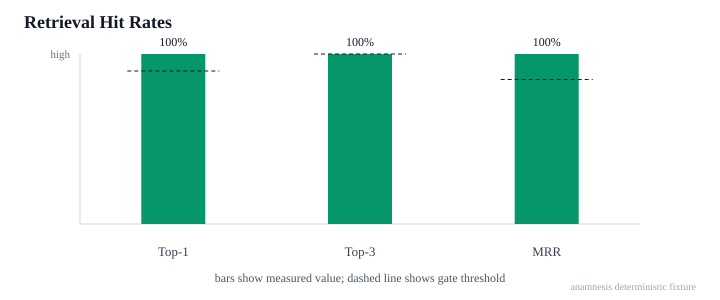
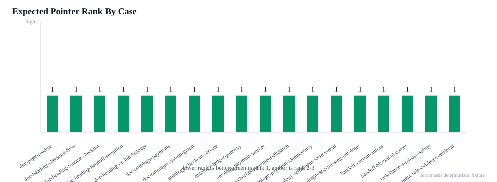
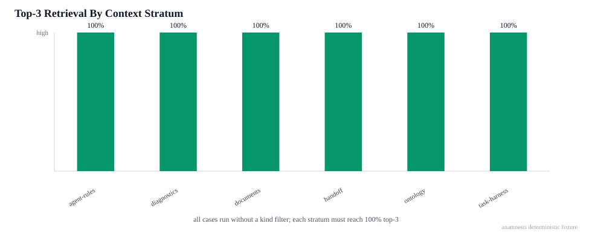

# Retrieval Source-Pointer Benchmark — 2026-08-28T03:49:58.948Z

Deterministic unfiltered benchmark for `context query` source-pointer ranking over public-safe mixed context sources.

Package: 1.21.0
Fixture hash: sha256:dc0edb75114705edb47d6b36dbeb44868bf02f12f6f02a4df90b3993ea6fe796
Ranker hash: sha256:b0737ddbcb78b1c5bbb5fd21c00c8fd82df6114cd5800fd3ba0457659755441e
Ranker inputs: src/commands/context_index.ts, src/commands/context_docs.ts, src/core/handoff_active_text.ts
Cases: 18
Top-1 hit rate: 100% (18/18)
Top-3 hit rate: 100% (18/18)
MRR: 1.000
Compact SessionStart: 206/800 estimated tokens
Safety checks: 2/2 passed
Behavioral validation: not-measured (use model-dependent task benchmarks)
Gate: pass

| Case | Stratum | Kind | Query | Expected pointer | Rank | Top-1 | Top-3 |
|---|---|---|---|---|---:|---|---|
| README doc page | documents | doc-page | Retrieval Fixture README canonical document page | README.md file | 1 | yes | yes |
| Checkout intent heading | documents | doc-heading | checkout intent flow payment authorization worker | docs/architecture.md heading:checkout-intent-flow | 1 | yes | yes |
| Release automation heading | documents | doc-heading | release automation checklist npm github generated drift | docs/architecture.md heading:release-automation-checklist | 1 | yes | yes |
| Handoff retention heading | documents | doc-heading | hot handoff archive cold source pointer retention policy | docs/operations.md heading:handoff-retention-policy | 1 | yes | yes |
| Orchid failover heading | documents | doc-heading | Orchid incident ledger gateway failover checkout replay | docs/runbook.md heading:orchid-failover-procedure | 1 | yes | yes |
| Payments ontology ref | documents | doc-ontology-ref | reviewed semantic flow recorded payments ontology edits | docs/architecture.md Ontology ref .anamnesis/ontology/payments.yaml | 1 | yes | yes |
| System graph ontology ref | documents | doc-ontology-ref | canonical top-level graph system graph | README.md Ontology ref system_graph.yaml | 1 | yes | yes |
| Checkout service entity | ontology | ontology-entity | checkout-service service entity top-level graph | system_graph.yaml checkout-service | 1 | yes | yes |
| Ledger gateway entity | ontology | ontology-entity | ledger-gateway settlement service entity | system_graph.yaml ledger-gateway | 1 | yes | yes |
| Payment worker entity | ontology | ontology-entity | payment-worker worker cobalt idempotency | .anamnesis/ontology/payments.yaml payment-worker | 1 | yes | yes |
| Checkout payment relationship | ontology | ontology-relationship | checkout payment dispatches worker relationship | .anamnesis/ontology/payments.yaml checkout-payment-dispatch | 1 | yes | yes |
| Payment idempotency rule | ontology | ontology-rule | cobalt idempotency key verification owner rule | .anamnesis/ontology/payments.yaml payment-idempotency-owner | 1 | yes | yes |
| Settlement source-read rule | ontology | ontology-rule | settlement routing changes payment ontology source read rule | system_graph.yaml settlement-source-read | 1 | yes | yes |
| Missing ontology diagnostic pointer | diagnostics | doc-ontology-ref | missing removed worker ontology evidence diagnostic | docs/diagnostics.md Ontology ref .anamnesis/ontology/missing.yaml | 1 | yes | yes |
| Current Aurora handoff | handoff | handoff-task | Aurora billing cutover cobalt queue next steps | .anamnesis/handoff/current.md Aurora billing cutover | 1 | yes | yes |
| Historical comet handoff | handoff | handoff-task | historical closed cold legacy invoice comet transport decision | .anamnesis/handoff/closed.md Legacy invoice transport decision | 1 | yes | yes |
| Release safety task harness | task-harness | task-harness | release safety package publication generated surface drift evidence | .anamnesis/task-harnesses/release-safety.yaml Release safety verification | 1 | yes | yes |
| Agent evidence retrieval rule | agent-rules | agent-rule | agent evidence retrieval contract source pointer snippets authority | AGENTS.md Evidence Retrieval Contract | 1 | yes | yes |

## Safety checks

| Check | Result | Violations |
|---|---|---:|
| Ordinary queries exclude stale handoff history | pass | 0 |
| Ordinary queries exclude missing ontology refs from top-3 | pass | 0 |

## Charts

