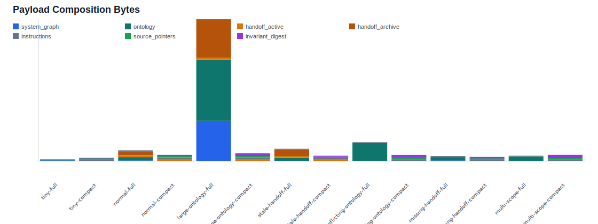
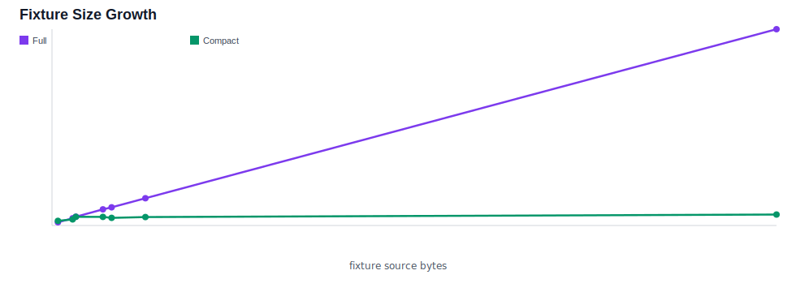

# Session Context Benchmark — 2026-06-19T03:47:03.664Z

Deterministic benchmark comparing full SessionStart file injection with compact source-pointer startup context.

Fixtures: 7
Compact required rules present: 7/7
Large fixture compact token reduction: 94%
Cap exceeded: compact 0, full 2

| Fixture | Full tokens | Compact tokens | Reduction | Compact source pointers | Compact cap | Required rules |
|---|---:|---:|---:|---:|---|---:|
| Tiny project | 88 | 126 | -43% | 2 | ok | 1/1 |
| Normal handoff | 439 | 235 | 46% | 4 | ok | 1/1 |
| Large ontology | 5352 | 298 | 94% | 5 | ok | 1/1 |
| Stale handoff | 495 | 207 | 58% | 3 | ok | 1/1 |
| Conflicting ontology | 744 | 229 | 69% | 3 | ok | 1/1 |
| Missing handoff | 196 | 165 | 16% | 2 | ok | 1/1 |
| Multi-scope repo | 238 | 237 | 0% | 3 | ok | 1/1 |

## Charts

