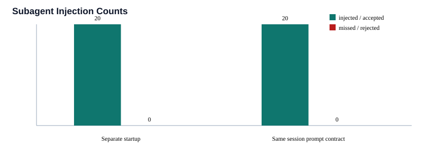
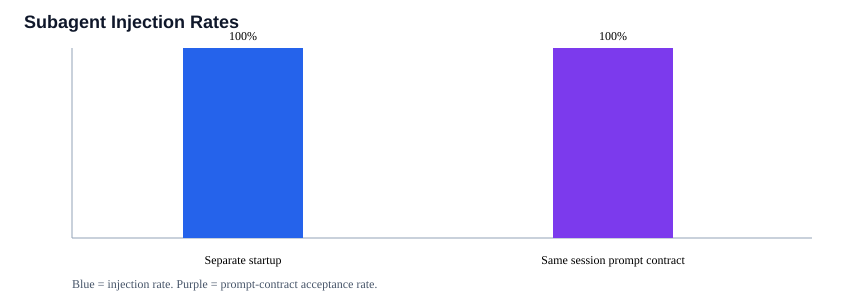

# Subagent Injection Benchmark — 2026-07-09T01:59:00.154Z

Deterministic benchmark for subagent context enforcement. Startup-hook or launcher-wrapper lanes count actual injection eligibility; same-session native subagents are reported as prompt-contract evidence, not as automatic SessionStart injection.

Requested attempts per lane: 20
Injection eligible attempts: 20/20 injected
Missed injections: 0
Prompt-contract accepted: 20/20

| Lane | Enforcement | Attempts | Injected | Missed | Accepted | Rejected | Rate |
|---|---|---:|---:|---:|---:|---:|---:|
| Separate process startup | startup-hook-or-wrapper | 20 | 20 | 0 | 0 | 0 | 100% |
| Same-session prompt contract | prompt-contract | 20 | 0 | 0 | 20 | 0 | 100% |

## Charts

