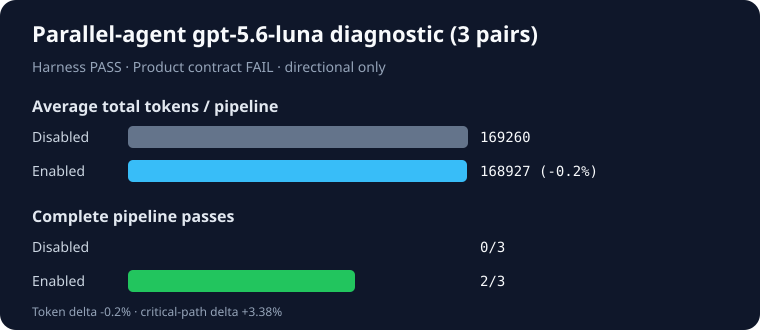

# Harness-orchestrated parallel-agent Work A/B

- Generated: 2026-08-26T13:14:07.166Z
- Protocol: `final` (claim eligible)
- Model: `gpt-5.6-luna` (reasoning effort: high)
- Implementation: `03ff23f20b1a50444917faac149a3548ad599d56`
- Prior final attempts: 0
- Scenarios: clean-partition, stale-cross-session-conflict, review-gate-recovery
- Pairs: 9
- Planned/actual invocations: 90/90
- Harness validity: **PASS**
- Product verdict: **FAIL_ACCURACY**
- Enabled absolute-quality gate: **PASS** (8/9)

| Condition | Exact reviewed pipelines | Child accuracy | Reviewer accuracy | Final accuracy | Critical path/run | Tokens/run |
| --- | ---: | ---: | ---: | ---: | ---: | ---: |
| Work disabled | 5/9 | 55.56% | 55.56% | 55.56% | 110921.91 ms | 253956.11 |
| Work enabled | 8/9 | 100% | 100% | 100% | 115693.28 ms | 277167.44 |

| Scenario family | Pairs | Disabled accuracy | Enabled accuracy | Delta | Reviewer exact | Final exact |
| --- | ---: | ---: | ---: | ---: | ---: | ---: |
| clean-partition | 3 | 33.33% | 100% | +66.67pp | 3/3 | 3/3 |
| stale-cross-session-conflict | 3 | 100% | 100% | 0pp | 3/3 | 3/3 |
| review-gate-recovery | 3 | 33.33% | 100% | +66.67pp | 2/3 | 3/3 |

Enabled won **4/9**, tied **5/9**, and lost **0/9**. Mean final-accuracy delta: **+44.44pp**; exact one-sided sign-test p-value: **0.06**.

| Preregistered gate | Result |
| --- | --- |
| Harness validity | PASS |
| Accuracy and per-family floor | FAIL |
| Absolute quality | PASS |
| Tokens (aggregate ≤+5%, p50 ≤+5%, bootstrap upper ≤+10%) | FAIL — p50 +8.7%, upper +14.4% |
| Critical path (p50 ≤+10%, bootstrap upper ≤+20%) | FAIL — p50 +10.86%, upper +21.83% |

## Claim boundary

This is the single held-out claim-eligible attempt for the recorded implementation commit. A pass means only that the preregistered three-scenario contract passed; it is not a general productivity or model-independent claim. The harness launches separate Codex processes and proves child interval overlap; it does not measure same-session native subagent spawning. All stage costs and failures are retained. No prompts, answers, stderr, PIDs, fixture bodies, or host paths are published.
