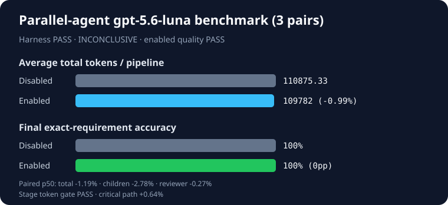

# Harness-orchestrated parallel-agent Work A/B

- Generated: 2026-08-27T14:19:16.347Z
- Protocol: `shadow` (diagnostic only)
- Model: `gpt-5.6-luna` (reasoning effort: high)
- Implementation: `b2a9975b4d0b0879ad07cc8b62e926d742d0f1cb`
- Prior paid attempts: 0
- Scenarios: clean-partition, stale-cross-session-conflict, review-gate-recovery
- Pairs: 3
- Planned/actual invocations: 24/24
- Harness validity: **PASS**
- Diagnostic contract: **PASS**
- Product verdict: **INCONCLUSIVE**
- Enabled audit/reviewer/final quality gate: **PASS** (3/3)

| Condition | Exact reviewed pipelines | Child accuracy | Reviewer accuracy | Final accuracy | Critical path/run | Tokens/run |
| --- | ---: | ---: | ---: | ---: | ---: | ---: |
| Work disabled | 3/3 | 100% | 100% | 100% | 50452.98 ms | 110875.33 |
| Work enabled | 3/3 | 100% | 100% | 100% | 50751.57 ms | 109782 |

| Scenario family | Pairs | Disabled accuracy | Enabled accuracy | Delta | Audit exact | Reviewer exact | Final exact |
| --- | ---: | ---: | ---: | ---: | ---: | ---: | ---: |
| clean-partition | 1 | 100% | 100% | 0pp | 1/1 | 1/1 | 1/1 |
| stale-cross-session-conflict | 1 | 100% | 100% | 0pp | 1/1 | 1/1 | 1/1 |
| review-gate-recovery | 1 | 100% | 100% | 0pp | 1/1 | 1/1 | 1/1 |

Enabled won **0/3**, tied **3/3**, and lost **0/3**. Mean final-accuracy delta: **0pp**; exact one-sided sign-test p-value: **1**.

| Preregistered gate | Result |
| --- | --- |
| Harness validity | PASS |
| Accuracy and per-family floor | PASS |
| Absolute quality | PASS |
| Tokens (aggregate ≤+5%, p50 ≤+5%, bootstrap upper ≤+10%) | PASS — p50 -1.19%, upper -0.98% |
| Combined child tokens (p50 ≤0%, bootstrap upper ≤+5%) | p50 -2.78%, upper -2.34% |
| Reviewer tokens (p50 ≤0%, bootstrap upper ≤+5%) | p50 -0.27%, upper -0.22% |
| Stage token gate | PASS |
| Critical path (p50 ≤+10%, bootstrap upper ≤+20%) | PASS — p50 +0.64%, upper +0.55% |

Audit digests are opaque code-generated fingerprints; the public aggregate artifact does not contain enough raw data to recompute them independently.

## Claim boundary

Validate and shadow protocols are never claim eligible. Their verdict remains INCONCLUSIVE even when the separate diagnostic contract passes. The harness launches separate Codex processes and proves child interval overlap; it does not measure same-session native subagent spawning. Audit digests and aggregate summaries are code-verified, but raw model answers are intentionally not published and therefore are not externally reconstructable from this artifact alone. All stage costs and failures are retained. No prompts, answers, stderr, PIDs, fixture bodies, or host paths are published.
