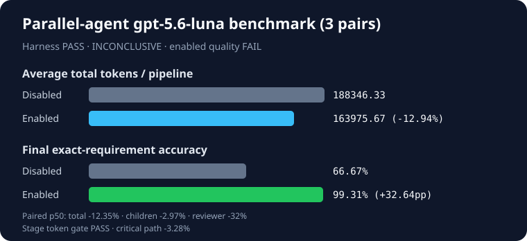

# Harness-orchestrated parallel-agent Work A/B

- Generated: 2026-08-26T14:54:15.850Z
- Protocol: `shadow` (diagnostic only)
- Model: `gpt-5.6-luna` (reasoning effort: high)
- Implementation: `4824bb26373bec7af2efc6a49ae2284f0ac78a7f`
- Prior final attempts: 0
- Scenarios: clean-partition, stale-cross-session-conflict, review-gate-recovery
- Pairs: 3
- Planned/actual invocations: 30/30
- Harness validity: **PASS**
- Product verdict: **INCONCLUSIVE**
- Enabled absolute-quality gate: **FAIL** (2/3)

| Condition | Exact reviewed pipelines | Child accuracy | Reviewer accuracy | Final accuracy | Critical path/run | Tokens/run |
| --- | ---: | ---: | ---: | ---: | ---: | ---: |
| Work disabled | 1/3 | 82.64% | 66.67% | 66.67% | 103538.88 ms | 188346.33 |
| Work enabled | 2/3 | 100% | 100% | 99.31% | 91099.36 ms | 163975.67 |

| Scenario family | Pairs | Disabled accuracy | Enabled accuracy | Delta | Reviewer exact | Final exact |
| --- | ---: | ---: | ---: | ---: | ---: | ---: |
| clean-partition | 1 | 0% | 100% | +100pp | 1/1 | 1/1 |
| stale-cross-session-conflict | 1 | 100% | 100% | 0pp | 1/1 | 1/1 |
| review-gate-recovery | 1 | 100% | 97.92% | -2.08pp | 1/1 | 0/1 |

Enabled won **1/3**, tied **1/3**, and lost **1/3**. Mean final-accuracy delta: **+32.64pp**; exact one-sided sign-test p-value: **0.75**.

| Preregistered gate | Result |
| --- | --- |
| Harness validity | PASS |
| Accuracy and per-family floor | FAIL |
| Absolute quality | FAIL |
| Tokens (aggregate ≤+5%, p50 ≤+5%, bootstrap upper ≤+10%) | PASS — p50 -12.35%, upper -9.99% |
| Combined child tokens (p50 ≤0%, bootstrap upper ≤+5%) | p50 -2.97%, upper -2.4% |
| Reviewer tokens (p50 ≤0%, bootstrap upper ≤+5%) | p50 -32%, upper -12.95% |
| Stage token gate | PASS |
| Critical path (p50 ≤+10%, bootstrap upper ≤+20%) | PASS — p50 -3.28%, upper -10.85% |

## Claim boundary

Validate and shadow protocols are never claim eligible. Their verdict remains INCONCLUSIVE even when harness and quality checks pass. The harness launches separate Codex processes and proves child interval overlap; it does not measure same-session native subagent spawning. All stage costs and failures are retained. No prompts, answers, stderr, PIDs, fixture bodies, or host paths are published.
