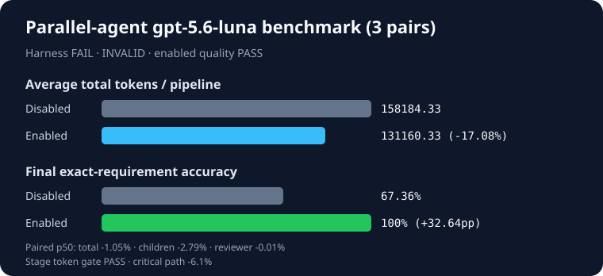

# Harness-orchestrated parallel-agent Work A/B

- Generated: 2026-08-27T12:30:10.702Z
- Protocol: `shadow` (diagnostic only)
- Model: `gpt-5.6-luna` (reasoning effort: high)
- Implementation: `ec6c8f876def4f264e5c9b66e0bffc07fe09cbd8`
- Prior final attempts: 0
- Scenarios: clean-partition, stale-cross-session-conflict, review-gate-recovery
- Pairs: 3
- Planned/actual invocations: 24/24
- Harness validity: **FAIL**
- Product verdict: **INVALID**
- Enabled absolute-quality gate: **PASS** (3/3)

| Condition | Exact reviewed pipelines | Child accuracy | Reviewer accuracy | Final accuracy | Critical path/run | Tokens/run |
| --- | ---: | ---: | ---: | ---: | ---: | ---: |
| Work disabled | 2/3 | 100% | 67.36% | 67.36% | 60837.97 ms | 158184.33 |
| Work enabled | 3/3 | 100% | 100% | 100% | 59014.93 ms | 131160.33 |

| Scenario family | Pairs | Disabled accuracy | Enabled accuracy | Delta | Reviewer exact | Final exact |
| --- | ---: | ---: | ---: | ---: | ---: | ---: |
| clean-partition | 1 | 100% | 100% | 0pp | 1/1 | 1/1 |
| stale-cross-session-conflict | 1 | 100% | 100% | 0pp | 1/1 | 1/1 |
| review-gate-recovery | 1 | 2.08% | 100% | +97.92pp | 1/1 | 1/1 |

Enabled won **1/3**, tied **2/3**, and lost **0/3**. Mean final-accuracy delta: **+32.64pp**; exact one-sided sign-test p-value: **0.5**.

| Preregistered gate | Result |
| --- | --- |
| Harness validity | FAIL |
| Accuracy and per-family floor | PASS |
| Absolute quality | PASS |
| Tokens (aggregate ≤+5%, p50 ≤+5%, bootstrap upper ≤+10%) | PASS — p50 -1.05%, upper -12.83% |
| Combined child tokens (p50 ≤0%, bootstrap upper ≤+5%) | p50 -2.79%, upper -2.28% |
| Reviewer tokens (p50 ≤0%, bootstrap upper ≤+5%) | p50 -0.01%, upper -20.87% |
| Stage token gate | PASS |
| Critical path (p50 ≤+10%, bootstrap upper ≤+20%) | PASS — p50 -6.1%, upper -3.61% |

## Claim boundary

Validate and shadow protocols are never claim eligible. A passing diagnostic remains INCONCLUSIVE; a failed harness is INVALID. The harness launches separate Codex processes and proves child interval overlap; it does not measure same-session native subagent spawning. All stage costs and failures are retained. No prompts, answers, stderr, PIDs, fixture bodies, or host paths are published.

## Failure analysis

All registered accuracy, absolute-quality, cost, stage-cost, and latency gates
passed, and enabled review/final accuracy was exact in all three scenarios. The
harness failed only `review_audit_exact`. In the disabled review-recovery case,
the reviewer retained 1/48 exact requirements; the deterministic audit then
correctly treated 46 child rows as unexpected relative to that reviewer output.
That audit necessarily differed from the fixture-oracle audit, so v7 conflated
a baseline reviewer product failure with harness validity. This artifact is
preserved without rerun and does not authorize a claim-eligible nine-pair run.
